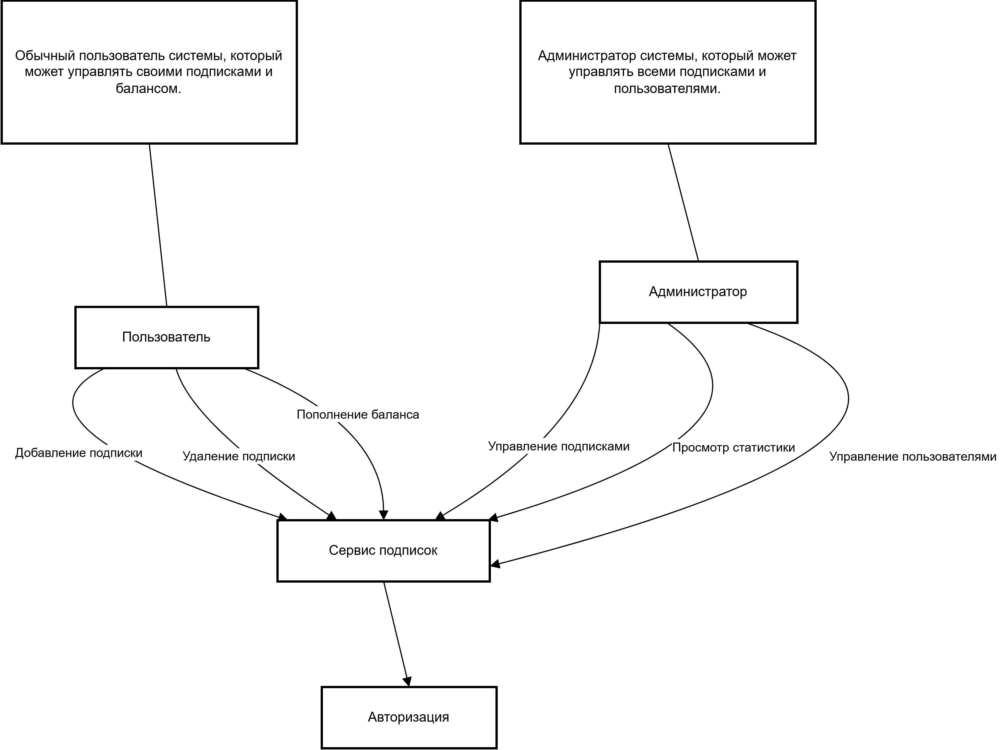
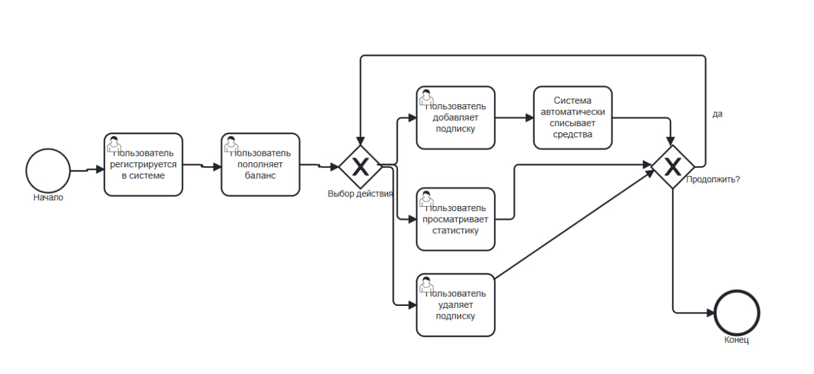
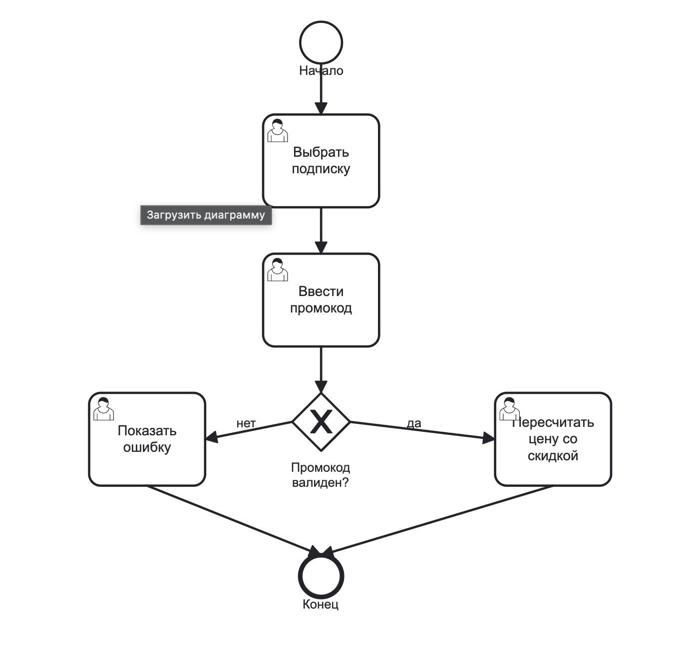
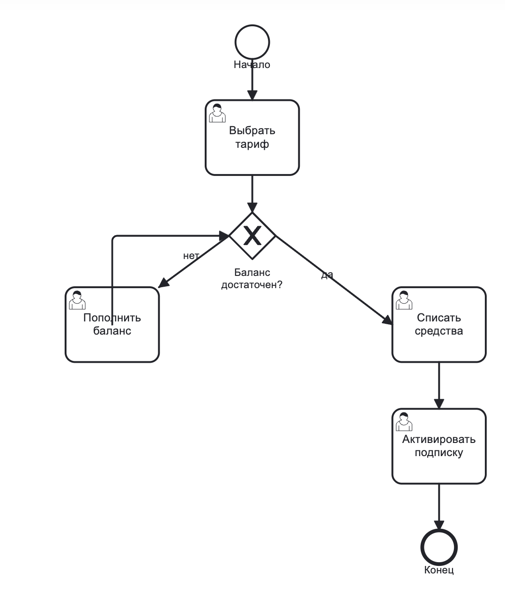
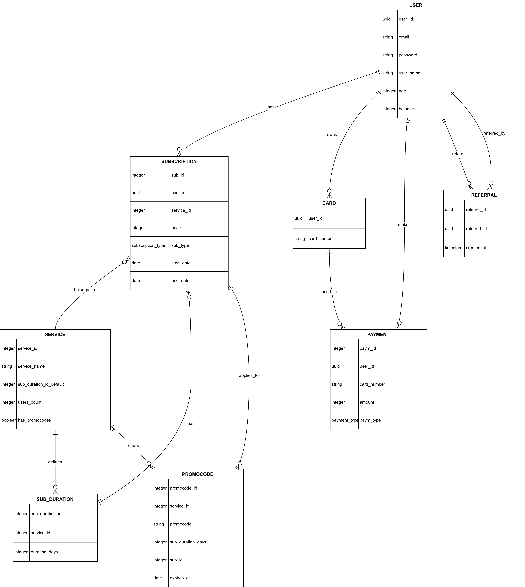
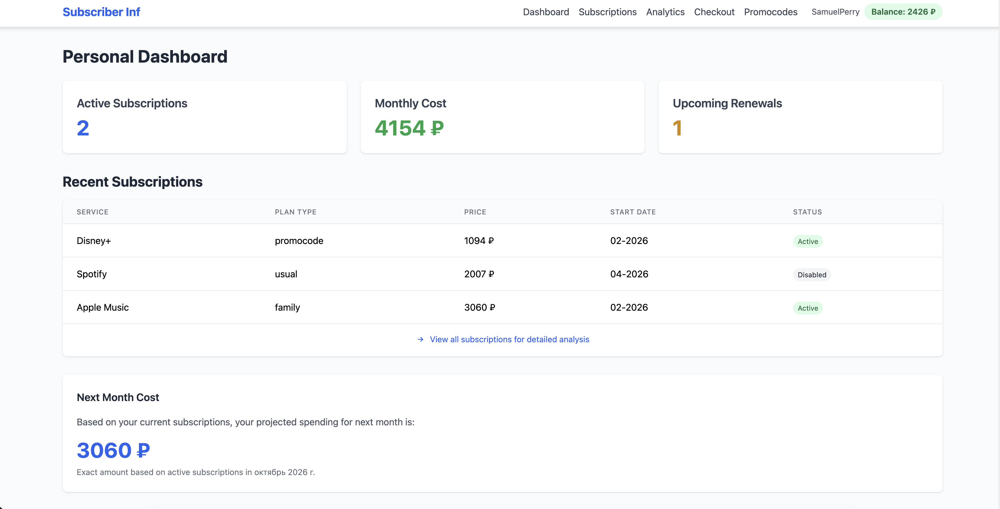
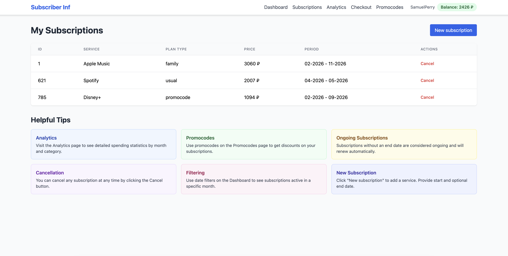
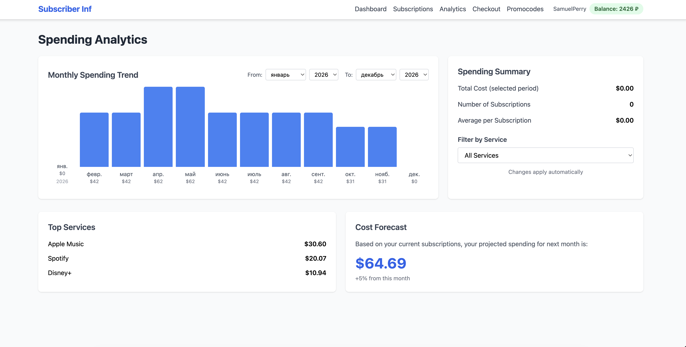
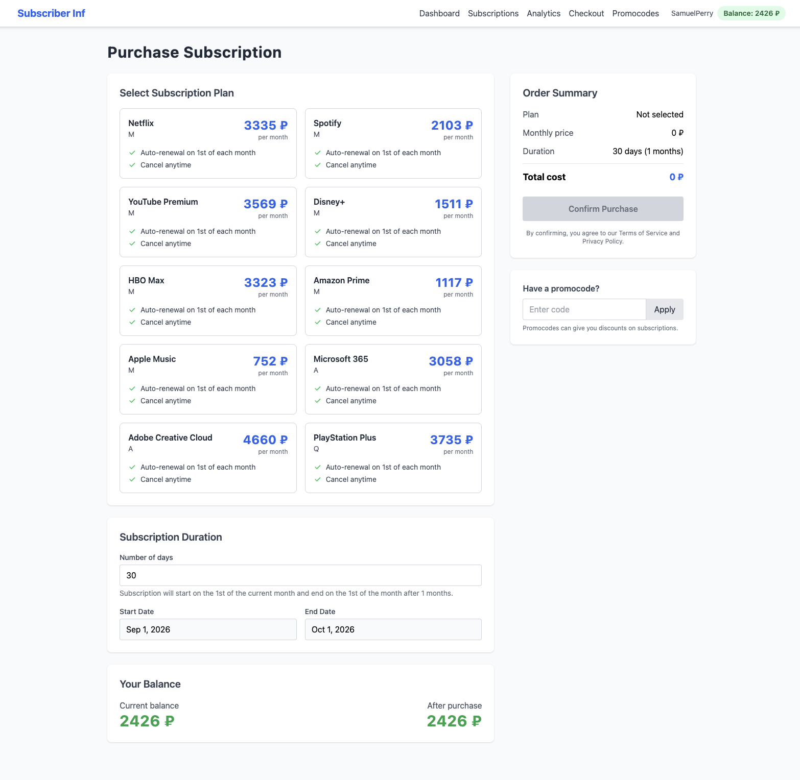
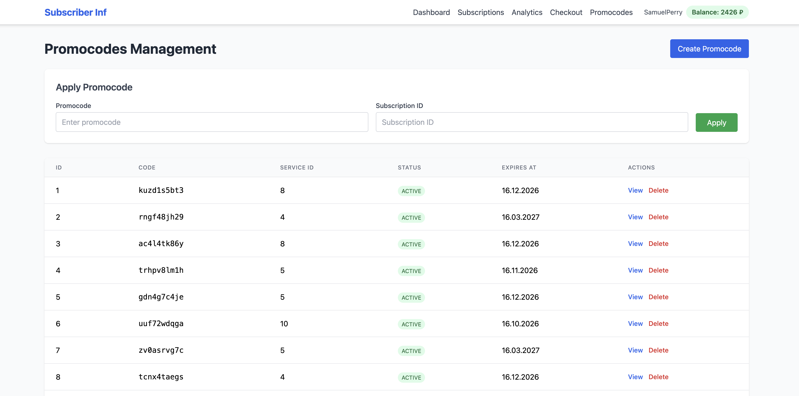

# WebLab #1 — «I'm a startuper (and/or a system architect)»

# Сервис подписок (Subscriber Inf)

> Трек: **ИИ-трек**. Проект развивается на базе ППО (репозиторий `subscriber-inf`, ветка `ppo`).

---

## 1. Цель работы и решаемая проблема

**Проблема.** Пользователи оформляют множество онлайн-подписок (Яндекс 360, Whoosh Pass, стриминги, музыка и т.п.) и часто забывают об автопродлениях, продолжая платить за неиспользуемые сервисы.

**Предоставляемая возможность.** «Сервис подписок» даёт возможность в одном месте:
- отслеживать все свои подписки и расходы на них;
- пополнять баланс и автоматически оплачивать подписки;
- применять промокоды для получения скидок;
- анализировать траты и отключать ненужные подписки.

**Предметная область (основные сущности):** Пользователь, Подписка, Сервис, Платёж, Промокод, Тариф (план подписки).

**Акторы (роли):**
- **Пользователь** — управляет своими подписками, балансом и статистикой.
- **Администратор** — управляет пользователями, подписками, тарифами и промокодами.

---

## 2. Требования

### 2.1 Функциональные требования

**Пользователь:**
| ID | Требование | Операция API |
|----|-----------|--------------|
| FR-1 | Просмотр списка своих подписок | `GET /subscriptions?uuid=` |
| FR-2 | Просмотр одной подписки | `GET /subscriptions/{id}` |
| FR-3 | Добавление подписки | `POST /subscriptions` |
| FR-4 | Обновление подписки | `PUT /subscriptions/{id}` |
| FR-5 | Отмена подписки | `DELETE /subscriptions/{id}` |
| FR-6 | Применение промокода к подписке | `POST /subscriptions/{id}/apply-promocode` |
| FR-7 | Покупка подписки по тарифу (списание баланса) | `POST /subscriptions/purchase` |
| FR-8 | Расчёт общих затрат за период | `POST /total_costs` |
| FR-9 | Просмотр доступных тарифов | `GET /subscription-plans` |
| FR-10 | Просмотр промокодов | `GET /promocodes` |
| FR-11 | Регистрация (создание пользователя) | `POST /users` |
| FR-12 | Просмотр профиля | `GET /users/{id}` |

**Администратор:**
| ID | Требование | Операция API |
|----|-----------|--------------|
| FR-13 | Управление промокодами (создание/изменение/удаление) | `POST`/`PUT`/`DELETE /promocodes` |
| FR-14 | Управление тарифами (создание/изменение/удаление) | `POST`/`PUT`/`DELETE /subscription-plans` |
| FR-15 | Удаление подписок | `DELETE /subscriptions/{id}` |
| FR-16 | Просмотр сводной статистики | `GET /stats/overview` |

### 2.2 Нефункциональные требования (измеримые)

| Категория | Требование | Метрика |
|-----------|-----------|---------|
| **Производительность** | Чтение подписок отзывчиво при типичном объёме данных | `p95(GET /subscriptions) ≤ 200 мс` при 1000 подписок |
| **Производительность** | Пропускная способность чтения | `≥ 50 RPS` на GET-эндпоинтах |
| **Надёжность** | Доступность сервиса | `≥ 99.5 %` (без плановых работ) |
| **Надёжность** | Восстановление после сбоя | RPO = 0 (данные персистентны), RTO ≤ 5 мин (подъём из `docker compose`) |
| **Безопасность** | Доступ к данным только авторизованных пользователей | разделение ролей «пользователь/администратор»; пароли не хранятся в открытом виде |

> Примечание: авторизация/разграничение ролей в текущем срезе кода (`ppo`) реализованы частично (см. раздел 12) — фиксируем их как целевое требование на WebLab #3+.

---

## 3. Use-case диаграмма

**Акторы:** Пользователь, Администратор.

**Use-case'ы:**
- Пользователь: Авторизация, Добавление подписки, Удаление подписки, Пополнение баланса, Управление подписками, Просмотр статистики.
- Администратор: Управление пользователями, Управление подписками, Управление промокодами/тарифами.

Редактируемый исходник: `documentation/diagrams/usecase.drawio`.

---

## 4. BPMN бизнес-процессов

### 4.1 Жизненный цикл подписки (основной)

Непрерывный цикл: **Регистрация → Пополнение баланса → Добавление подписки → Автоматическое списание → Просмотр статистики → Удаление подписки**. Нелинейность задают шлюзы **«Выбор действия»** (разветвление между действиями) и **«Продолжить?»** (цикл). Исходник: `documentation/diagrams/business_process.bpmn`.

### 4.2 Применение промокода

**Начало → Выбрать подписку → Ввести промокод → *Промокод валиден?***

- **да** → Пересчитать цену со скидкой → **Конец** (успех);
- **нет** (не найден / истёк / превышен лимит / не применим) → Показать ошибку → **Конец** (ошибка).

Нелинейность — развилка на шлюзе валидации. Исходник: `documentation/diagrams/apply_promocode.bpmn`.

### 4.3 Покупка подписки по тарифу

**Начало → Выбрать тариф → *Баланс достаточен?***

- **да** → Списать средства → Активировать подписку → **Конец**;
- **нет** → Пополнить баланс → *(возврат к проверке баланса)*.

Нелинейность — цикл пополнения. Исходник: `documentation/diagrams/purchase_subscription.bpmn`.

---

## 5. Пользовательские сценарии (с критериями приёмки)

### 5.1 Добавление подписки

1. Пользователь открывает личный кабинет → раздел «Мои подписки».
2. Нажимает «Добавить подписку», выбирает сервис, указывает тип и срок.
3. Подтверждает добавление.

- **Критерий успеха:** подписка создана и отображается в списке; API возвращает `201`.
- **Критерий ошибки:** невалидная дата/тип → `400` с сообщением, подписка не создаётся.
- **Связь:** требование FR-3 · сущность `Subscription` · экран **Subscriptions**.

### 5.2 Применение промокода

1. Пользователь выбирает подписку, вводит промокод, применяет.
2. Система валидирует промокод и пересчитывает цену.

- **Критерий успеха:** скидка применена; ответ `200` с `discount_applied` и `new_price`.
- **Критерий ошибки:** промокод не найден → `404`; истёк/превышен лимит/не применим → `400`; цена не меняется.
- **Связь:** требование FR-6 · сущности `Promocode` + `Subscription` · экран **Promocodes**.

### 5.3 Покупка подписки по тарифу

1. Пользователь открывает «Checkout», выбирает тариф, подтверждает покупку.
2. Система проверяет баланс, списывает средства, активирует подписку.

- **Критерий успеха:** средства списаны, подписка активирована; ответ `200` с `sub_id`.
- **Критерий ошибки:** недостаточно средств → `402 Payment Required`, подписка не создаётся.
- **Связь:** требование FR-7 · сущности `SubscriptionPlan` + `Payment` + `Subscription` · экран **Checkout**.

### 5.4 Просмотр статистики расходов (дополнительно)

1. Пользователь открывает «Analytics», выбирает период, просматривает графики/таблицы.

- **Критерий успеха:** отображается суммарная стоимость и детализация за период (`POST /total_costs` → `200`).
- **Критерий ошибки:** нет данных за период → пустой результат / `404`.
- **Связь:** требование FR-8 · сущность `Subscription` · экран **Analytics**.

---

## 6. ER-диаграмма сущностей

Ключевые сущности и связи: `users 1—* subscriptions *—1 services`, `services 1—* subscription_plans`, `promocodes`, `payments`, `cards`, `user_referrals`. Редактируемые исходники: `documentation/diagrams/er.drawio`, `er_diagram.puml`, `er_diagram.mmd`.

---

## 7. Технологический стек

| Слой | Технология |
|------|-----------|
| Бэкенд | Go 1.25, фреймворк `gorilla/mux`, `pgx` (PostgreSQL), `go-redis`, `logrus`, `oapi-codegen` |
| Фронтенд | Vue 3 (Composition API) + TypeScript-сборка Vite, Pinia, Vue Router, Tailwind, Axios |
| БД | PostgreSQL 15 (основная), Redis 7 (кэш) |
| Документация API | OpenAPI 3.0 (`doc.yaml`) — источник истины для кодогенерации |
| Доставка | Docker + Docker Compose (backend, frontend, postgres, redis) |

---

## 8. Диаграмма базы данных

Таблицы: `users`, `subscriptions`, `services`, `subscription_plans`, `sub_durations`, `promocodes`, `payments`, `cards`, `user_referrals`. Схема задаётся миграциями `migrations/*.up.sql` (001–007) + функции/процедуры/триггеры в `migrations/{functions,procedures,triggers}/`.

---

## 9. Диаграммы C4

### Контекстная (L1)

Акторы (Пользователь, Администратор) взаимодействуют с «Сервисом подписок», который использует PostgreSQL и Redis.

### Контейнерная (L2)

Контейнеры: SPA-приложение, REST API (Go), PostgreSQL, Redis.

### Компонентная (L3)

Внутренние компоненты бэкенда: слои `delivery` → `usecase` → `service` (репозитории) → `domain`; кэш-репозитории в Redis.

Редактируемый исходник всех уровней: `C4.drawio`.

---

## 10. Экраны приложения (SPA)

| Экран | Назначение |
|-------|-----------|
| **Dashboard** | Сводка: приветствие, баланс, список активных подписок |
| **Subscriptions** | Управление подписками: добавление, редактирование, отмена |
| **Analytics** | Статистика расходов за период |
| **Checkout** | Покупка подписки по тарифу |
| **Promocodes** | Список промокодов и их применение |

### Dashboard

### Subscriptions

### Analytics

### Checkout

### Promocodes

---

## 11. Архитектурные решения (ADR)

### ADR-1. Хранение данных: PostgreSQL + Redis

**Контекст.** Нужен основной сторадж для пользователей/подписок/промокодов/платежей и быстрый доступ к часто читаемым данным (промокоды, тарифы).

**Решение.** Основная СУБД — **PostgreSQL** (реляционная модель, транзакции, FK, функции/триггеры для бизнес-логики). **Redis** — кэш промокодов и тарифов (TTL).

**Рассмотренные альтернативы:**
- *MySQL* — исторически поддерживается (`internal/service/mysql`, `migrations_mysql`), но миграции/функции/процедуры уже написаны под Postgres, и Postgres богаче (JSONB, индексы). **Отклонено** как основная.
- *SQLite* — не выдерживает многопользовательскую нагрузку и конкуренцию. **Отклонено**.
- *Только Postgres без кэша* — лишняя нагрузка на БД при частых чтениях промокодов. Добавлен Redis.

**Последствия.** Два хранилища в стеке; необходимо следить за инвалидацией кэша.

### ADR-2. Разделение компонентов: модульный монолит (чистая архитектура)

**Контекст.** Как организовать компоненты приложения.

**Решение.** **Модульный монолит** с чистой архитектурой: `domain` (сущности/интерфейсы) → `usecase` (бизнес-логика) → `service` (репозитории Postgres/MySQL/Redis) → `delivery` (HTTP-handlers). Разделение по слоям, а не по сервисам; СУБД абстрагирована паттерном Repository.

**Рассмотренные альтернативы:**
- *Микросервисы (SOA)* — преждевременно для текущего масштаба; добавит межсервисные вызовы и трассировки. **Отложено** до WebLab #6 (там декомпозиция обязательна).
- *Монолит без слоёв* — быстрее, но трудно тестировать и менять хранилище. **Отклонено**.

**Последствия.** Простой запуск (один бинарь), лёгкое тестирование юзкейсов; при росте — выделение сервисов (задел на WebLab #6).

---

## 12. Разбор противоречий и принятые решения (ИИ-трек)

**Выявленные противоречия:**
1. API оперирует строкой `service_name`, а БД связывает подписку с сервисом через `plan_id` (`subscriptions → subscription_plans → services`). Генератор данных падал именно на этой нестыковке.
2. README/use-case описывают роли и авторизацию, но в коде (`ppo`) авторизация не реализована — доступ не разграничен.
3. `doc.yaml` — OpenAPI 3.0.4, пути без префикса `/api/v1`; часть ответов противоречит HTTP-семантике (напр. `DELETE` с телом), `GET /promocodes` местами не реализован (`501`).
4. СУБД: конфиг указывал `type: mysql`, но CLI и миграции — под Postgres; две парадигмы доступа (`pgxpool` vs `database/sql`).

**Принятые/уточнённые решения (≥3):**
1. **Уточнено:** основная СУБД — PostgreSQL (а не MySQL), т.к. миграции, функции и CLI написаны под неё; MySQL оставлен как экспериментальный адаптер. → закреплено в ADR-1.
2. **Принято:** оставляем `service_name` в API как есть, связь «подписка↔сервис» ведём через `plan_id`; переделывать API на `service_id` отложено до WebLab #2.
3. **Принято:** роли/авторизацию в WebLab #1 не включаем (в `ppo` их нет) — фиксируем как целевое НФТ для WebLab #3+.
4. **Отклонено:** использовать MySQL как основную, несмотря на наличие `internal/service/mysql`, — из-за готовых Postgres-миграций и функций.
